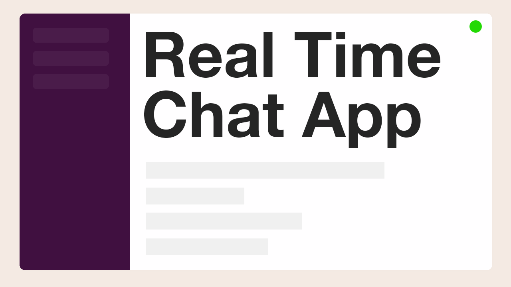

# Description

Source code for the lambda function from the screencast <a href="https://youtu.be/BcWD-M2PJ-8" target="_blank">How to build a chat using Lambda + WebSocket + API Gateway? (nodejs)</a>

# Deploy to AWS

- follow the video and create your lambda function and API Gateway websocket endpoint
- copy the connection url <a href="https://youtu.be/BcWD-M2PJ-8?t=420">as described</a> in the video to [this constant](/actions.js#L12)
- make sure the region and lambda function name are correct in the [deploy](package.json#L7) command
- run `npm run deploy` 🚀